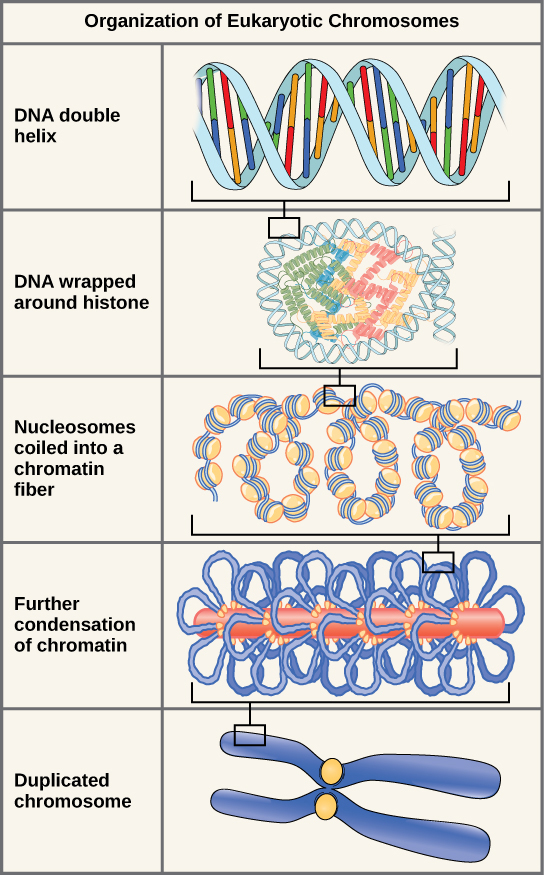
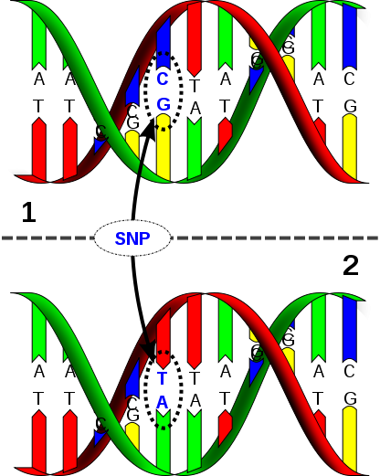

## DNA Structure

## What is a SNP?

A SNP (Single Nucelotide Polymorphism) is a single base-pair location in the genome where we observe variation across people.

Because we have two chromosomes (one from each parent), we will have two copies (values) at any SNP.

For example, if my dad gave me a copy (allele) with an A, and my mom gave me a copy (allele) with a G, my genotype at that SNP location would be AG.

For this exercise, we've simplified the genotypes. Try and figure out how.

## SNP Frequencies

We classify the different genotypes based on how frequently they are observed in the population. 

Nomenclature: if a genotype is observed most of the time, we term that genotype the wild type. The other

For example: "AA" is observed at SNP location 50% of the time, the genotype "GA" is observed 40

## SNPs are associated with disease

## Questions about the genomic data

1) How many genotypes exist in the data? That is, given SNP1, SNP2, SNP3, SNP4, what combinations of these exist in the data? Are there combinations that you never see?

2) What are the individual genotypes associated with? David talked about one possible association. Do you see one?

3) Are there any genotypes that seem to change outcome overall?
